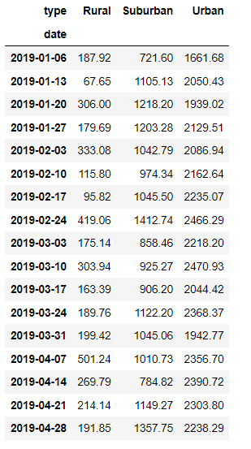
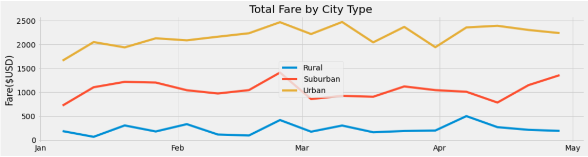

#PyBer Analysis

##Overview of Project
**Using Pandas and matplotlib, writing a  report that summarizes how the data differs by city type and how those differences can be used by decision-makers at PyBer. **

###Purpose
<b> V. Isualize wanted to have a written report of the ride-sharing data by total fares for each city type on the given time frame to aid the PyBer decision making. </b>

##Challenges
Although the given data was clean, Using the pivot and resample functions were challenging.  
Those were a little difficult to derive from the imagination of what it should be like once it is used. 
However, googling and reading documentation online helped to generate the DataFrame look like this.

##Analysis / Results
As shown below, the multiple-line chart is telling the story that the urban had higher fare rides compared to the Suburban and Rural areas.  
The data is telling us that the further away from the urban area, the lower fare was recorded.

##Summary
The multiple-line chart indicated that the driparities between each city types have a ample gap to make an improvement to reduce the gap, 
although it also means that the Urban fares had more buisness than other areas therefore the business should focus on urban area to provide good services to make business more profitable.
However, the business decision is to make, it should consider other factors might contribute this disparities other than the data given, such as the city type econmic, population, and generation status.

###Based on the results, provide three business recommendations to the CEO for addressing any disparities among the city types.
  <li> The business should be more focus on close to the Urban rather than Rural Area where the time frame is recorded in ths data. </li>
  <li> Anayze the economic, population, and the generation status between different city types find other contributers to this results. </li>
  <li> To keep track of more data since this anyalsis were very short term, to tell exactly what is happend around different seasons. </li>
  
 
